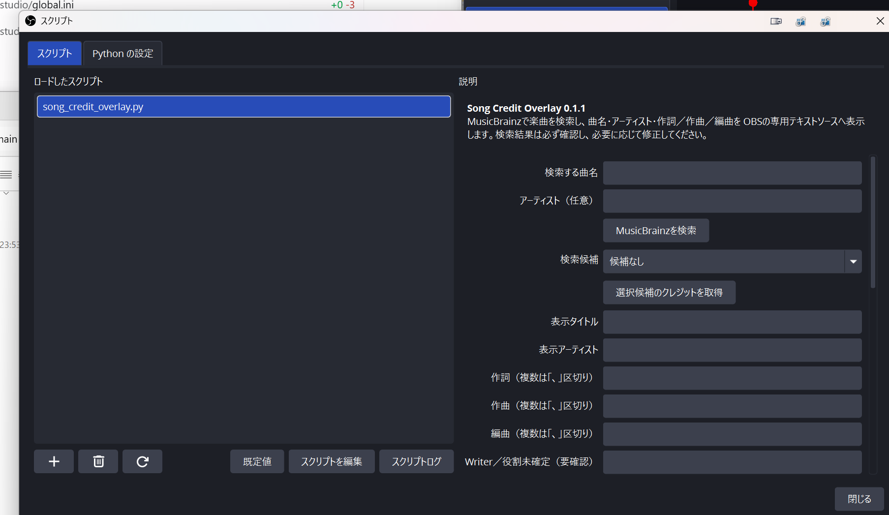

# Song Credit Overlay for OBS

歌枠で、曲名・アーティスト・作詞・作曲・編曲をOBS画面に出すためのスクリプトです。

曲名を入力して検索し、候補を選ぶとクレジット欄へ自動入力します。表示前に自分で直せるので、検索で見つからない曲も手入力できます。背景画像と一緒に使えます。

> [!IMPORTANT]
> このスクリプトが歌詞を表示したり、楽曲利用の許可を取ったりすることはありません。クレジットは必ず公式情報などでも確認してください。

## まずはこの5つだけ

1. このページ右上の緑色の **Code** を押し、**Download ZIP** を押します。
2. ダウンロードしたZIPを右クリックし、**すべて展開**します。
3. Windowsへ64bit版の **Python 3.12** をインストールします。
4. OBSで曲名・アーティスト・クレジット用の「テキスト（GDI+）」を3個作ります。
5. OBSの **ツール → スクリプト** でPythonの場所を設定し、`song_credit_overlay.py` を追加します。

以下で、ひとつずつ詳しく説明します。

## 用意するもの

- Windows 10または11
- OBS Studio 30以降
- Python 3.12（64bit版）
- インターネット接続（新しい曲を検索するときだけ）

動作確認済みの組み合わせは **OBS Studio 32.1.2 + Python 3.12.7（Windows 64bit）** です。追加ライブラリのインストールは不要です。

## 1. ファイルをダウンロードする

1. GitHubページ右上の緑色の **Code** を押します。
2. 出てきたメニューの **Download ZIP** を押します。
3. ダウンロードした `obs-song-credit-overlay-main.zip` を右クリックします。
4. **すべて展開**を押します。
5. 展開したフォルダを、消さない場所へ移動します。例：`ドキュメント\OBS用ツール`

フォルダ内の次の2ファイルは、必ず同じ場所に置いてください。

```text
song_credit_overlay.py  ← OBSへ追加するファイル
song_credit_core.py     ← 一緒に必要なファイル
```

`song_credit_core.py` のほうをOBSへ追加する必要はありません。

## 2. Pythonをインストールする

すでにOBSのPythonスクリプトを使っている場合は、この章を飛ばして構いません。

1. [Python公式のWindows版ダウンロードページ](https://www.python.org/downloads/windows/)を開きます。
2. Python 3.12の **Windows installer (64-bit)** をダウンロードします。
3. ダウンロードしたインストーラーを開きます。
4. 最初の画面下側にある **Add python.exe to PATH** にチェックを入れます。
5. **Install Now** を押し、完了するまで待ちます。

> Python 3.13などではなく、まずは動作確認済みの3.12をおすすめします。OBS側の対応状況によって使える版が変わることがあります。

## 3. OBSに表示用テキストを作る

OBSを開き、歌枠で使うシーンを選びます。

1. 「ソース」欄の **＋** を押します。
2. **テキスト（GDI+）** を選びます。
3. 名前を `Song Title` にして作成します。
4. 同じ手順で `Song Artist` と `Song Credits` も作ります。

合計3個です。

| OBSのソース名 | 表示する内容 |
| --- | --- |
| `Song Title` | 曲名 |
| `Song Artist` | アーティスト名 |
| `Song Credits` | 作詞・作曲・編曲 |

文字のフォント、色、ふち取り、大きさは、それぞれのテキストソースのプロパティで好きに設定できます。

### 背景画像と組み合わせる場合

1. 「ソース」の **＋ → 画像** から背景画像を追加します。
2. ソース一覧で、背景画像を3個のテキストより下に置きます。
3. 背景画像と3個のテキストを選び、右クリックして **選択したアイテムをグループ化**します。

グループごと移動・表示・非表示ができるようになるので、配信中の操作が楽になります。

## 4. OBSにPythonの場所を教える

1. OBS上部の **ツール → スクリプト** を開きます。
2. **Python の設定** タブを押します。
3. 「Pythonインストールパス」の **参照** を押します。
4. Python 3.12をインストールしたフォルダを選びます。

通常は次のような場所です。

```text
C:\Users\あなたのWindowsユーザー名\AppData\Local\Programs\Python\Python312
```

選ぶのは `python.exe` というファイルではなく、`Python312` フォルダです。

画面に **Loaded Python Version: 3.12.x** のように表示されたら成功です。一度OBSを再起動してください。

## 5. スクリプトをOBSへ追加する

1. OBS上部の **ツール → スクリプト** を開きます。
2. **スクリプト** タブを押します。
3. 左下の **＋** を押します。
4. ダウンロードして展開した `song_credit_overlay.py` を選びます。
5. 左側の一覧に `song_credit_overlay.py` が出たら、それをクリックします。
6. 右側に「検索する曲名」などの入力欄が表示されます。この画面で合っています。
7. マウスカーソルを右側の入力欄の上へ移動し、マウスホイールで下へスクロールします。右端の細いスクロールバーをつかんで下げても構いません。
8. 「Writer／役割未確定」「確認事項」よりさらに下まで進むと、出力先の設定が出てきます。
9. 出力先を次のように選びます。

> [!NOTE]
> スクリプトを選んだ直後の画面には、出力先が見えていません。左側のスクリプト一覧ではなく、**右側の設定欄だけを下へスクロール**してください。

右側の設定は、上からおおよそ次の順に並んでいます。

```text
検索する曲名・アーティスト
検索候補
表示タイトル・表示アーティスト
作詞・作曲・編曲
Writer／役割未確定
確認事項
　↓ さらに下へスクロール
曲名の出力先
アーティストの出力先
クレジットの出力先
```

| スクリプトの設定 | 選ぶOBSソース |
| --- | --- |
| 曲名の出力先 | `Song Title` |
| アーティストの出力先 | `Song Artist` |
| クレジットの出力先 | `Song Credits` |

3つを選べたら、ここまでで導入は完了です。

### 1920×1080の下部へ自動配置

「初回表示時に1920×1080の下部へ自動配置」は、最初からチェックが入っています。初めて **OBSへ表示** を押したとき、現在のシーンにある3個のテキストを次の位置へ整列します。

| 内容 | 左位置 | 上位置 | 表示枠 |
| --- | ---: | ---: | ---: |
| 曲名 | 160px | 650px | 幅1600px × 高さ90px |
| アーティスト | 160px | 760px | 幅1600px × 高さ60px |
| クレジット | 160px | 850px | 幅1600px × 高さ100px |

文字は表示枠へ収まるよう自動調整されます。初回配置後にOBS上で位置や大きさを手動調整しても、曲を切り替えるたびに元へ戻ることはありません。

位置が崩れた場合や別のシーンで使う場合は、対象のシーンを表示してから **出力先を1920×1080の下部へ配置し直す** を押してください。

## 配信前に曲を登録する

### まず、この画面を開く

曲の検索は、OBSのいつものメイン画面から直接行うのではありません。次の順でスクリプト画面を開きます。

1. OBS上部の **ツール** を押します。
2. メニューの **スクリプト** を押します。
3. 左側の「ロードしたスクリプト」にある `song_credit_overlay.py` を押します。
4. 右側に「検索する曲名」「アーティスト（任意）」が表示されます。ここから曲を登録します。



上の画像と同じ画面になれば準備完了です。入力やボタン操作は、すべて画像右側の設定欄で行います。

### 曲を1曲登録する

検索中は数秒だけOBSのスクリプト画面が固まったように見えることがあります。配信中ではなく、できれば配信前にセットリストを検索して履歴へ入れておくのがおすすめです。

1. **検索する曲名**を入力します。
2. 同名曲が多い場合は、**検索するアーティスト**も入力します。
3. **MusicBrainzを検索**を押します。
4. **検索候補**から正しい曲を選びます。
5. **選択候補のクレジットを取得**を押します。
6. 「表示タイトル」「表示アーティスト」「作詞」「作曲」「編曲」を確認します。
7. 足りない内容や表記の違いがあれば、自分で書き直します。
8. **OBSへ表示**を押します。

表示した曲は「最近使った楽曲」へ保存されます。次回からは曲を選んで **選択した履歴を読み込む** を押すだけで呼び出せます。

検索で見つからない曲は、「表示タイトル」から下の欄へ直接入力して **OBSへ表示** を押してください。

## 配信中の操作

- 曲を出す：**OBSへ表示**
- 曲間で消す：**非表示（出力先を空にする）**
- 前に使った曲を出す：「最近使った楽曲」で選択 → **選択した履歴を読み込む** → **OBSへ表示**

OBSの **設定 → ホットキー** から、次の操作へ好きなキーを割り当てられます。

- `楽曲クレジット: 表示`
- `楽曲クレジット: 非表示`

誤操作を避けるため、ほかの操作と重ならないキーの組み合わせがおすすめです。

## 表示例

日本語：

```text
夜に駆ける
YOASOBI
作詞：Ayase　作曲：Ayase　編曲：Ayase
```

英語：

```text
夜に駆ける
YOASOBI
Lyrics: Ayase / Music: Ayase / Arrangement: Ayase
```

「クレジット表記」の設定から、日本語・英語・コンパクト表記を選べます。

## 困ったとき

### Pythonを設定しても読み込まれない

- 64bit版OBSには、64bit版Pythonを使ってください。
- `python.exe` ではなく、`Python312` フォルダを選んでください。
- 設定後にOBSを再起動してください。
- OBSの「Python設定」に対応バージョンが表示されている場合は、その案内を優先してください。

### スクリプトを追加するとエラーが出る

- `song_credit_overlay.py` と `song_credit_core.py` が同じフォルダにあるか確認してください。
- ZIPの中身を直接開かず、先に **すべて展開**してください。
- OBSへ追加するのは `song_credit_overlay.py` です。

### 出力先にSong Titleなどが出てこない

- 先にOBSで「テキスト（GDI+）」ソースを作ってください。
- 作成後、スクリプトを一覧でいったん別の項目へ切り替え、もう一度選んでください。
- 直らない場合は、スクリプト画面を閉じて開き直してください。

### 検索しても候補が見つからない

- 曲名の記号やサブタイトルを外して検索してください。
- アーティスト欄を空にする、または正式名へ変えてみてください。
- 見つからない場合は表示欄へ手入力できます。

### 作詞・作曲が空欄、または内容が違う

検索先のMusicBrainzに情報がない場合があります。CDブックレット、公式サイト、配信サービスの公式クレジット、権利情報データベースなどで確認し、表示欄を手動で直してください。

### 「非表示」にしたら別の文字も消えた

「非表示」は指定したテキストソースの中身を空にします。このスクリプト専用のテキストソースだけを出力先にしてください。

## データと注意事項

- 楽曲検索には共同編集データベースの[MusicBrainz](https://musicbrainz.org/)を使います。
- 歌詞本文は取得・保存・表示しません。
- J-WIDなどのサイトを自動巡回・スクレイピングしません。
- MusicBrainzの情報は欠けていたり、誤っていたりする場合があります。
- `writer` とだけ登録された人物は、作詞者・作曲者へ自動変換せず「Writer／役割未確定」欄へ表示します。
- 曲名やクレジットを表示するための道具であり、配信での楽曲利用許諾を代行するものではありません。

履歴は自分のPC内にだけ保存されます。保存場所は次のとおりです。

```text
%APPDATA%\obs-studio\plugin_config\song-credit-overlay\history.json
```

同じMusicBrainz Recording IDの曲は重複せず、最大100件保存されます。

## アンインストール

1. OBSの **ツール → スクリプト** を開きます。
2. `song_credit_overlay.py` を選び、左下の **－** を押します。
3. 不要なら、ダウンロードして展開したフォルダを削除します。

履歴も消したい場合だけ、次のファイルを削除してください。

```text
%APPDATA%\obs-studio\plugin_config\song-credit-overlay\history.json
```

## 開発者向け

OBSを起動せずにコア機能とOBSスクリプトの読み込みをテストできます。

```powershell
python -m unittest discover -s tests -v
```

```text
song-credit-overlay/
├─ song_credit_overlay.py
├─ song_credit_core.py
├─ README.md
└─ tests/
   ├─ test_core.py
   └─ test_obs_script_smoke.py
```
