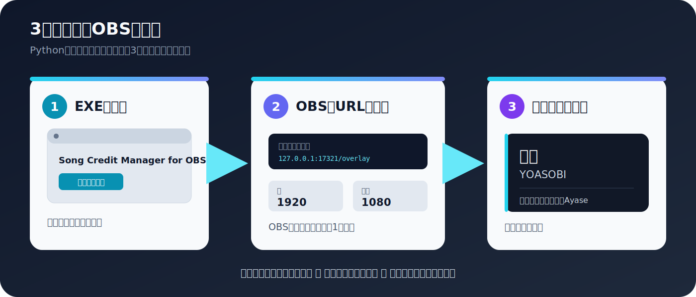
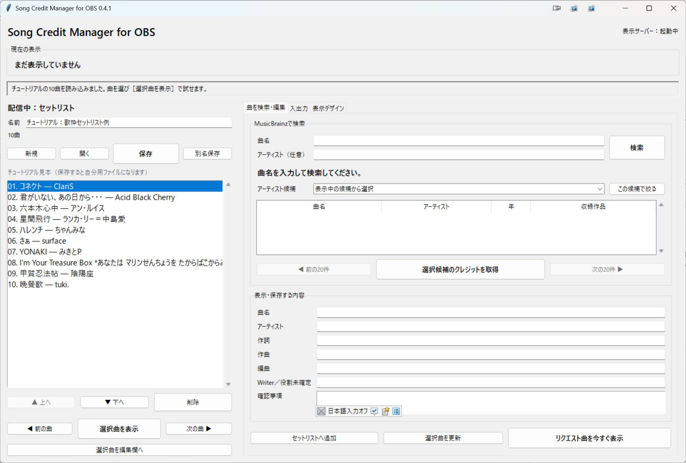
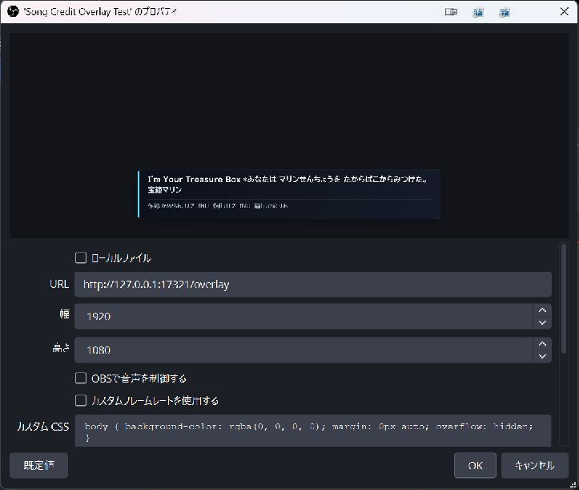
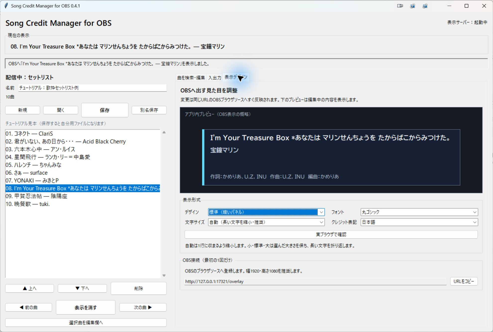

# Song Credit Manager for OBS

歌枠で歌っている曲の **曲名・アーティスト・作詞・作曲・編曲**を、OBSの画面下部へ表示するWindows向けアプリです。

配信前にセットリストを作って保存し、配信中はボタンで前後の曲へ切り替えられます。急なリクエスト曲も、セットリストを崩さず表示できます。



## このアプリでできること

- 曲名からMusicBrainzを検索し、クレジット候補を入力する
- 検索結果を確認・修正してからOBSへ表示する
- 複数のセットリストをファイルとして保存する
- 配信中に「前の曲」「次の曲」「表示を消す」を1か所で操作する
- リクエスト曲をセットリストへ追加せず緊急表示する
- 暗いパネル・明るいパネル・文字のみから表示デザインを選ぶ
- フォント・文字サイズ・クレジット表記を変更し、アプリ内で確認する

Pythonのインストールは不要です。OBS側で作るソースも **ブラウザソース1個だけ**です。

> [!IMPORTANT]
> このアプリは歌詞を表示せず、配信での楽曲利用許可も代行しません。検索結果には不足や誤りがあるため、CDブックレットや公式サイトなどでも確認してください。

## 必要なもの

- Windows 10または11
- OBS Studio 30以降
- インターネット接続（曲を検索するときだけ）

## はじめて使う：ダウンロードから最初の1曲まで

### 1. アプリをダウンロードする

1. [最新版のダウンロードページ](https://github.com/kikake77/obs-song-credit-overlay/releases/latest)を開きます。
2. ページ下部の **Assets** を開きます。
3. `SongCreditManagerForOBS_v0.4.1_Windows.zip` をダウンロードします。
4. ZIPを右クリックし、**すべて展開**を押します。
5. 展開したフォルダーを、ドキュメントなど消さない場所へ移動します。

ZIPの中身を直接開かず、必ず先に展開してください。

### 2. 管理アプリを起動する

1. 展開したフォルダーの `SongCreditManagerForOBS.exe` をダブルクリックします。
2. 画面右上が **表示サーバー：起動中**になるまで待ちます。

配信中はこのアプリを閉じないでください。Windowsの警告が出た場合は、配布元とリリースページ記載のSHA-256を確認し、不安があれば実行を中止してください。

起動直後は、説明用の123曲から選んだ **チュートリアル10曲**が左の一覧へ入っています。保存済みファイルではないため、そのまま試しても元の見本は壊れません。



### 3. OBSへ表示場所を作る（最初の1回だけ）

1. OBSを起動します。
2. 歌枠で使うシーンを選びます。
3. **ソース**欄の **＋** を押します。
4. **ブラウザ**を選びます。
5. 新規作成を選び、名前を `楽曲クレジット` にします。
6. URLへ次を貼り付けます。

```text
http://127.0.0.1:17321/overlay
```

7. **幅を1920、高さを1080**にします。
8. **OK**を押します。

これでOBS側の初期設定は完了です。ブラウザソースは画面全体の大きさですが、クレジット自体は画面下部だけに表示されます。



**ローカルファイル**はOFFのままにします。**カスタムCSS**は初期値のままで構いません。

> [!NOTE]
> このURLはインターネット上のサイトではありません。起動中の管理アプリへ、同じPC内から接続するためのURLです。

### 4. チュートリアルの曲を表示してみる

1. 左の10曲から、試したい曲をクリックします。
2. 一覧下の **選択曲を表示**を押します。
3. OBSのプレビュー下部へ曲名とクレジットが出たら成功です。
4. 同じボタンが **表示を消す**へ変わることも確認します。

チュートリアルを編集して **保存**すると、保存先を選ぶ画面が開き、自分用のセットリストとして保存できます。空の状態から作る場合は左上の **新規**を押します。

### 5. 最初の曲を検索する

1. アプリ右側の **曲を検索・編集**タブを開きます。
2. **曲名**へ歌う曲を入力します。
3. 同名曲が多そうな場合は、**アーティスト**も入力します。
4. **検索**を押します。
5. 候補から正しい曲を選びます。
6. **選択候補のクレジットを取得**を押します。

検索結果が多い場合は、全候補数と現在表示している範囲が出ます。**次の20件**や**アーティスト候補**で絞り込めます。

### 6. 表示内容を確認する

検索後、画面下側の次の欄を確認します。

- 曲名
- アーティスト
- 作詞
- 作曲
- 編曲
- Writer／役割未確定

空欄や表記違いがあれば、この場で直接書き直せます。検索で見つからない曲も、曲名から下の欄へ手入力できます。

### 7. セットリストへ入れてOBSへ表示する

1. **セットリストへ追加**を押します。
2. 左の一覧に曲が追加されたことを確認します。
3. 左の曲をクリックします。
4. 一覧下の **選択曲を表示**を押します。
5. OBSのプレビュー下部へ曲名とクレジットが出たら成功です。

表示中は同じボタンが **表示を消す**へ変わります。表示と非表示は、この中央ボタンだけで操作できます。

## 画面の見方

| 場所 | 役割 | いつ使う？ |
| --- | --- | --- |
| 画面上部「現在の表示」 | OBSへ出している曲を確認 | 配信中 |
| 画面上部の細いステータス欄 | 検索中・保存完了・エラーを確認 | 操作のたび |
| 左側「セットリスト」 | 曲順、保存、前後移動、表示・非表示 | 配信前と配信中 |
| 曲を検索・編集 | 検索、内容修正、曲追加、緊急表示 | 曲を登録するとき |
| 入出力 | CSV・TSV・TXTの取り込み、CSV書き出し | 外部ファイルを使うときだけ |
| 表示デザイン | 見た目、フォント、文字サイズ、クレジット表記 | 配信準備中 |

## 配信前：セットリストを準備する

### 新しいセットリストを作る

1. 左上の **新規**を押します。
2. 例として `7月歌枠` のような名前を付けます。
3. **曲を検索・編集**タブから曲を追加します。
4. 曲を選び、**▲ 上へ**・**▼ 下へ**で曲順を整えます。
5. 不要な曲は**削除**します。
6. 左上の **保存**を押します。

初回の保存では、保存場所を選ぶ画面が開きます。通常は次のフォルダーが表示されます。

```text
ドキュメント\Song Credit Manager for OBS\Setlists
```

セットリストの拡張子は `.scolist.json` です。別のPCへ持っていく場合は、このファイルをコピーします。

### 保存したセットリストを開く

1. 左上の **開く**を押します。
2. 使う `.scolist.json` を選びます。
3. 左の曲一覧が切り替わったことを確認します。

内容を変更したら **保存**、別のセットリストとして残すなら **別名保存**を押します。

## 配信中：曲を切り替える

- 一覧から曲を選び、**選択曲を表示**
- 曲順どおりに進むなら **次の曲 ▶**
- 1曲戻るなら **◀ 前の曲**
- 曲間だけ消すなら、中央の **表示を消す**

今OBSへ出ている内容は、画面上部の **現在の表示**で確認できます。

## 配信中：リクエスト曲をすぐ表示する

1. **曲を検索・編集**タブでリクエスト曲を検索します。
2. 表示内容を確認・修正します。
3. **リクエスト曲を今すぐ表示**を押します。

この操作では、準備したセットリストの曲順は変わりません。次に **次の曲 ▶**を押すと、元の進行へ戻れます。

## 表示デザインを変更する

1. **表示デザイン**タブを開きます。
2. **デザイン**から次のどれかを選びます。
   - 標準（暗いパネル）
   - 明るいパネル
   - 文字のみ（背景パネルなし）
3. **フォント**を選びます。
4. **文字サイズ**を選びます。
   - 自動（長い文字を縮小・推奨）
   - 小
   - 標準
   - 大
5. **クレジット表記**を日本語・英語・コンパクトから選びます。
6. タブ上部のプレビューで確認します。

変更は自動保存され、同じURLを登録したOBSへすぐ反映されます。OBSのURLを変更する必要はありません。**自動**は長い文字を1行に収まるまで縮小します。**小・標準・大**は選んだ大きさを維持し、長い文字を折り返します。



背景画像と組み合わせる場合は、OBSのソース一覧で背景画像を `楽曲クレジット` より下へ置きます。

## CSV・TSV・TXTを使う

通常の保存と読み込みは、左の **保存**と**開く**を使ってください。**入出力**タブは、Excelなどで作った曲順を取り込む場合だけ使います。

CSV・TSVの見出しには次の名前を使えます。

```text
曲名,アーティスト,作詞,作曲,編曲,Writer,確認事項
```

TXTは1行につき1曲で、次のように書けます。

```text
夜に駆ける / YOASOBI
祝福 / YOASOBI
```

取り込み後は、左の **別名保存**で専用形式へ保存してください。

### 同梱サンプルで取り込みを試す

`docs\samples\歌枠セットリスト例.tsv` に、123曲分の説明用セットリストがあります。

1. アプリの **入出力**タブを開きます。
2. **CSV／TSV／TXTを読み込む**を押します。
3. `docs` → `samples` → `歌枠セットリスト例.tsv` の順に選びます。
4. 左の一覧へ123曲が表示されたことを確認します。
5. 必要な曲を選び、**選択曲を編集欄へ**でクレジットを確認します。
6. 自分用に残す場合は、左上の **別名保存**を押します。

作詞・作曲はMusicBrainzと追加の楽曲情報から検索した候補です。各行の「確認事項」にあるとおり、配信前にCD・公式サイトなどで確認してください。

## 困ったとき

### OBSに何も出ない

次の順に確認します。

1. `SongCreditManagerForOBS.exe` が起動中か
2. アプリ右上が **表示サーバー：起動中**か
3. OBSのURLが `http://127.0.0.1:17321/overlay` か
4. OBSブラウザソースの幅が1920、高さが1080か
5. OBSソースの目アイコンがONか
6. アプリで曲を選び、**選択曲を表示**を押したか

ブラウザでは見えるのにOBSだけ真っ黒な場合は、OBSブラウザソースのカスタムCSSをいったん空にしてから、ソースを再読み込みしてください。

### 表示デザインを変えてもOBSへ反映されない

1. OBSのブラウザソースを右クリックし、**プロパティ**を開きます。
2. **現在のページのキャッシュを更新**を押します。
3. **OK**を押します。

アプリを更新した直後だけ、OBSが古い表示ページを保持している場合があります。v0.4.1以降は表示ページのバージョンを検出し、今後の更新では自動再読み込みできるようにしています。

### 表示位置や大きさがおかしい

- OBSブラウザソースを幅1920・高さ1080にします。
- OBSのプレビューでブラウザソースを右クリックし、**変換 → 変換をリセット**を試します。
- アプリ側の表示は1920×1080の画面下部を基準にしています。

### 曲が見つからない

- 曲名の記号やサブタイトルを外します。
- アーティスト欄を空にします。
- アーティスト名を正式表記へ変えます。
- 見つからなければ表示欄へ直接入力します。

### 作詞・作曲が空欄、または内容が違う

MusicBrainzに情報がない場合があります。CDブックレット、公式サイト、配信サービスの公式クレジット、権利情報データベースなどで確認し、表示欄を手動で直してください。

### 「ポート17321を使用できません」と出る

管理アプリを複数起動しています。未保存のセットリストを保存してから、古い画面を閉じ、1個だけ起動してください。

## 旧バージョンから更新する

1. 旧版で未保存のセットリストを保存します。
2. 旧版を閉じます。
3. 新しいZIPを別フォルダーへ展開します。
4. `SongCreditManagerForOBS.exe` を起動します。
5. OBSのURLはそのまま使います。
6. 初回だけOBSブラウザソースの **プロパティ → 現在のページのキャッシュを更新**を押します。

旧名 `Song Credit Overlay` のフォルダーに保存されたセットリストと表示設定も読み込めます。

## データとプライバシー

- 表示サーバーは `127.0.0.1` だけで待ち受け、同じPCからのみ接続できます。
- 楽曲検索には共同編集データベースの[MusicBrainz](https://musicbrainz.org/)を使います。
- 歌詞本文は取得・保存・表示しません。
- MusicBrainzの情報には不足や誤りがある場合があります。

## 従来のOBS Pythonスクリプト版

既存利用者向けに `song_credit_overlay.py` も残しています。新しく導入する場合は、Python設定が不要でOBS更新の影響を受けにくいEXE＋ブラウザソース方式をおすすめします。

## 開発者向け

### テスト

```powershell
python -m unittest discover -s tests -v
```

### EXEをビルド

```powershell
python -m pip install -r requirements-build.txt
.\build_exe.ps1
```

完成したファイルは `dist\SongCreditManagerForOBS.exe` です。

## ライセンス

このソフトウェアは[MIT License](LICENSE)で公開しています。著作権表示と許諾表示を残すことで、利用・改変・再配布できます。
